# CV5570 Assignment 2 - Object Detection Report

**Indian Institute of Technology Madras**  
CV5570: Computer Vision for Construction Engineering  
Submitted by: N P J Vedhaanth | Roll number: ID26S422

GitHub repository: https://github.com/wick1-22/Assignment-2-CV5570

**Draft: some required saved outputs are still missing.**

## Contents
1. Executive Summary
2. Objective and Scope
3. Dataset Description and Preprocessing
4. Detector Methods and Training Setup
5. Validation Results
6. Training and Convergence
7. Detection Examples and Failure Analysis
8. Comparison and Deployment Discussion
9. Limitations
10. Conclusion
11. References

## 1. Executive Summary

This report compares Faster R-CNN, RetinaNet, and RT-DETR-L on 3,929 ACID images. The highest validation mAP@0.5:0.95 was from RT-DETR-L (0.750); the highest measured speed was RetinaNet (16.8 FPS). All results use the same saved validation split.

## 2. Objective and Scope

The aim was to train one detector from each of the two-stage, one-stage, and transformer families on the ACID dataset. The comparison reports class-wise average precision, speed, parameter count, training time, loss history, and validation examples for Dozer, Dump Truck, and Excavator.

## 3. Dataset Description and Preprocessing

The selected subset contains 3,929 images and 7,614 object instances. Annotations are in COCO JSON format with pixel boxes stored as [x, y, width, height]. The split uses seed 42 and proportions 70/20/10.

| Split | Images | Instances | Dozer | Dump Truck | Excavator |
|---|---:|---:|---:|---:|---:|
| Train | 2,750 | 5,351 | 776 | 2,614 | 1,961 |
| Val | 785 | 1,499 | 243 | 715 | 541 |
| Test | 394 | 764 | 104 | 372 | 288 |

The median normalized box area is 0.088; the median width-to-height ratio is 1.45. The held-out test split is not used for the reported model-selection metrics.

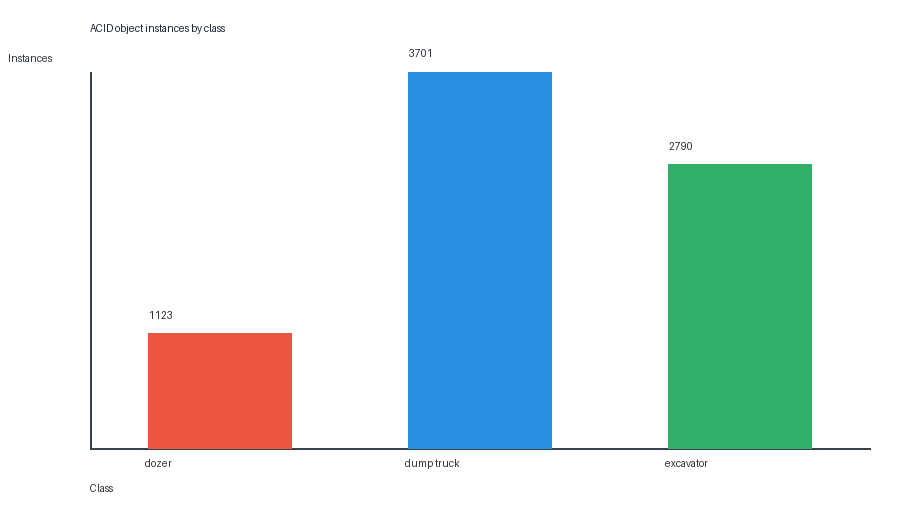

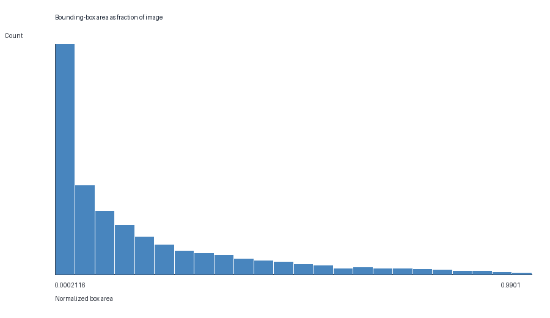

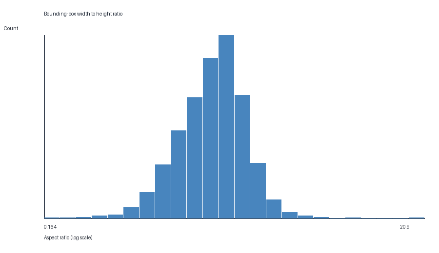

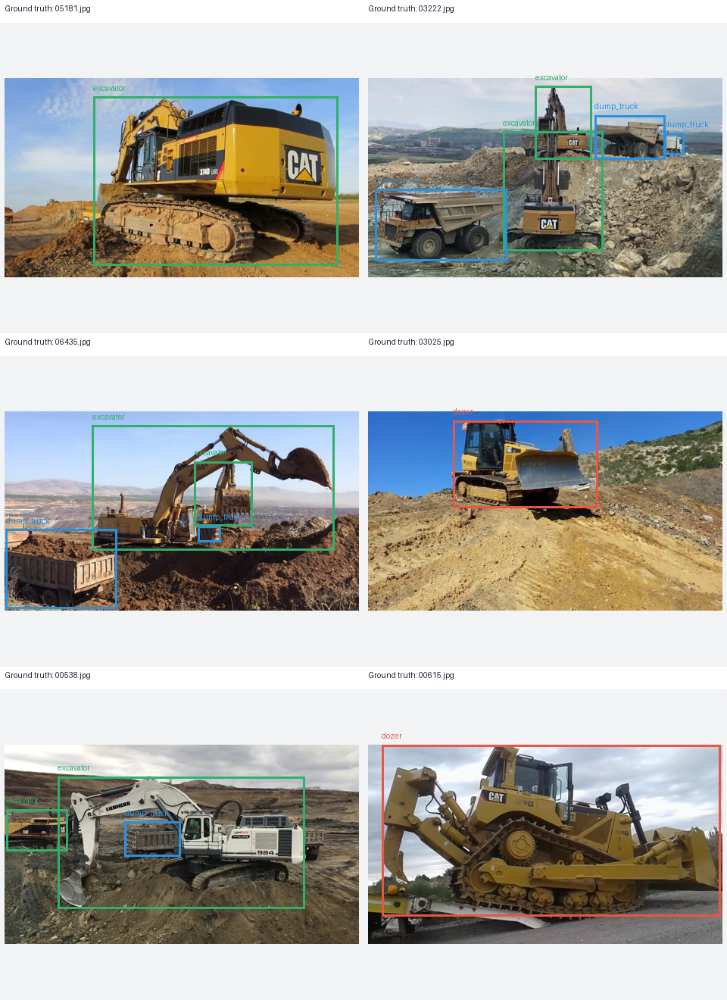

## 4. Detector Methods and Training Setup

**Faster R-CNN.** The region proposal network selects candidate regions; the second stage classifies and refines them. It was chosen as a two-stage baseline for equipment that appears at different sizes in cluttered construction scenes (Ren et al., 2015). The model starts from TorchVision COCO-pretrained ResNet-50-FPN v2 weights.

**RetinaNet.** RetinaNet predicts class scores and box offsets in one pass. Its focal loss reduces the contribution from easy background locations, which are common in object detection (Lin et al., 2017). It provides the one-stage comparison. The model starts from TorchVision COCO-pretrained ResNet-50-FPN v2 weights.

**RT-DETR-L.** This transformer detector uses an encoder/decoder and set-based predictions. It was selected to compare a transformer-based approach on cluttered scenes and to measure its speed/accuracy trade-off (Zhao et al., 2024). It starts from the pretrained `rtdetr-l` checkpoint. The prediction interface used here does not return attention maps, so its errors are reviewed from the validation boxes.

The models use the same saved split, 640-pixel inputs, 10-epoch budget, and disabled augmentation. The model-specific optimizer settings and runtime values are recorded below.

| Model | Checkpoint | Optimizer | Learning rate | Batch | Epochs | Device |
|---|---|---|---:|---:|---:|---|
| Faster R-CNN | Faster R-CNN ResNet50-FPN v2 COCO weights | SGD | 0.0050 | 2 | 10 | cuda |
| RetinaNet | RetinaNet ResNet50-FPN v2 COCO weights | SGD | 0.0005 | 2 | 10 | cuda |
| RT-DETR-L | rtdetr-l.pt | AdamW | 0.0014 | 2 | 10 | cuda:0 |

Faster R-CNN used SGD at learning rate 0.005. RetinaNet used 0.0005 after the initial 0.005 run produced non-finite losses. Both used momentum 0.9 and weight decay 0.0005. RT-DETR used the optimizer settings saved by Ultralytics.

## 5. Validation Results

| Model | Family | mAP@0.5 | mAP@0.5:0.95 | FPS | Parameters (M) | Training time (min) |
|---|---|---:|---:|---:|---:|---:|
| Faster R-CNN | two-stage | 0.929 | 0.679 | 9.6 | 43.27 | 138.7 |
| RetinaNet | one-stage | 0.896 | 0.625 | 16.8 | 36.37 | 79.3 |
| RT-DETR-L | transformer | 0.939 | 0.750 | 13.0 | 32.81 | 72.3 |

### Class-wise average precision

| Model | Class | AP@0.5 | AP@0.5:0.95 |
|---|---|---:|---:|
| Faster R-CNN | Dozer | 0.937 | 0.691 |
| Faster R-CNN | Dump Truck | 0.896 | 0.617 |
| Faster R-CNN | Excavator | 0.953 | 0.729 |
| RetinaNet | Dozer | 0.939 | 0.674 |
| RetinaNet | Dump Truck | 0.817 | 0.549 |
| RetinaNet | Excavator | 0.933 | 0.654 |
| RT-DETR-L | Dozer | 0.948 | 0.754 |
| RT-DETR-L | Dump Truck | 0.910 | 0.677 |
| RT-DETR-L | Excavator | 0.958 | 0.818 |

## 6. Training and Convergence

Faster R-CNN: its validation objective changed by 5.9% from epoch 1 to the last epoch and was flattening or changing direction near the end. RetinaNet: its validation objective changed by 37.2% from epoch 1 to the last epoch and was still decreasing at the end. RT-DETR-L: its validation objective changed by 27.4% from epoch 1 to the last epoch and was still decreasing at the end. The minimum recorded validation loss occurred at epoch Faster R-CNN 5, RetinaNet 10, RT-DETR-L 10. For 10 epochs, recorded training time was Faster R-CNN 138.7 min, RetinaNet 79.3 min, RT-DETR-L 72.3 min. RT-DETR-L reached its lowest recorded validation loss at epoch 10, compared with epoch 5 for Faster R-CNN and epoch 10 for RetinaNet. Its 72.3-minute run was shorter in wall time than Faster R-CNN (138.7 min) and RetinaNet (79.3 min); loss definitions differ, so this compares convergence timing rather than loss magnitude. Loss definitions differ across architectures, so compare their within-run trends and time-to-best rather than the absolute loss values.

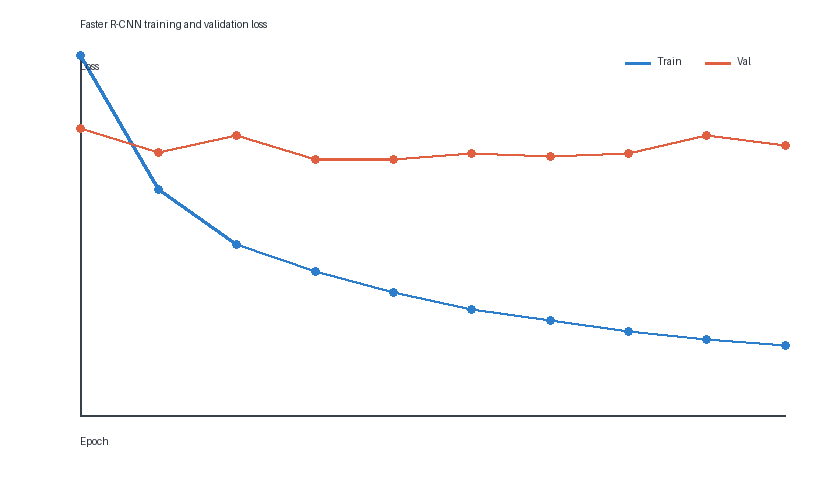

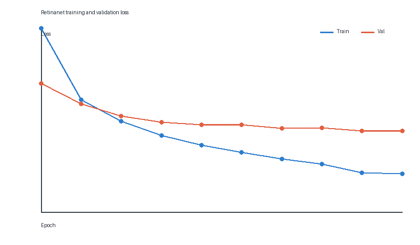

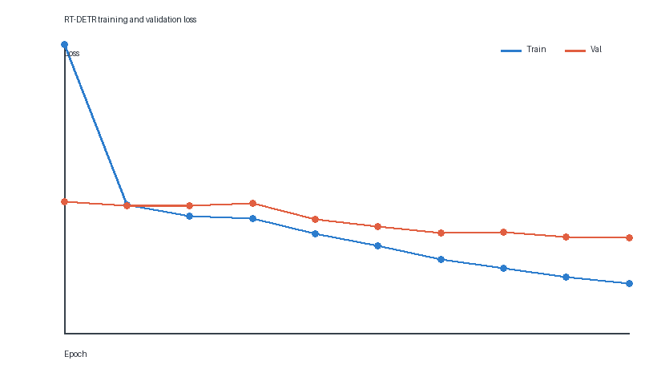

## 7. Detection Examples and Failure Analysis

Green boxes mark ground-truth objects and red boxes mark predictions. The boards show selected validation successes and failures using the same selection rule for each model.

### Faster R-CNN

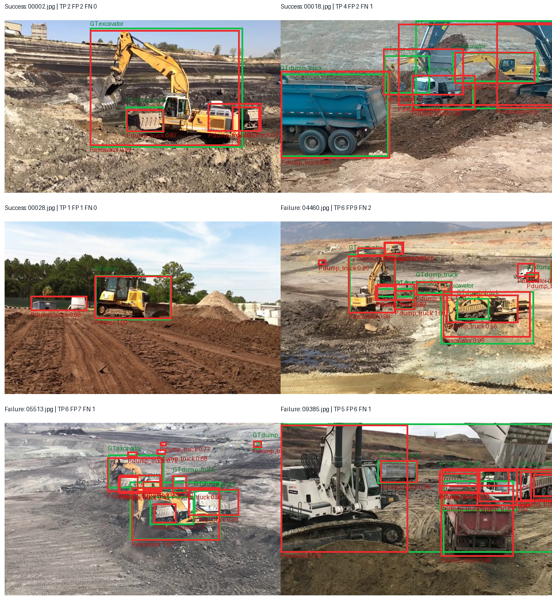

### RetinaNet

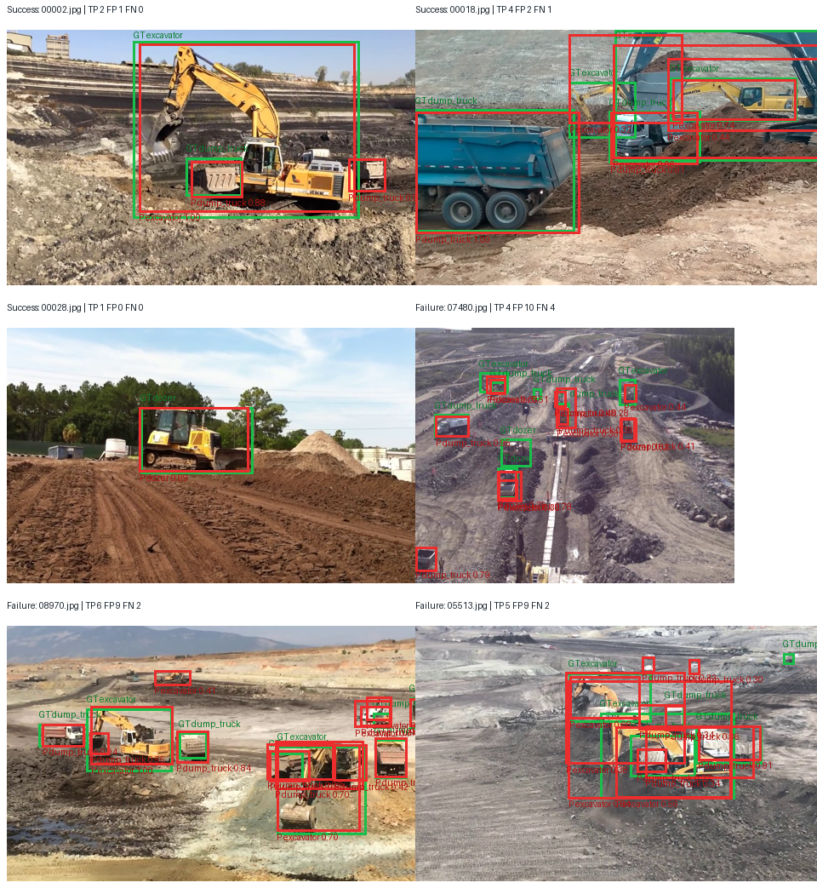

| Type | Image | TP | FP | FN |
|---|---|---:|---:|---:|
| Success | 00002.jpg | 2 | 1 | 0 |
| Success | 00018.jpg | 4 | 2 | 1 |
| Success | 00028.jpg | 1 | 0 | 0 |
| Failure | 07480.jpg | 4 | 10 | 4 |
| Failure | 08970.jpg | 6 | 9 | 2 |
| Failure | 05513.jpg | 5 | 9 | 2 |

### RT-DETR-L

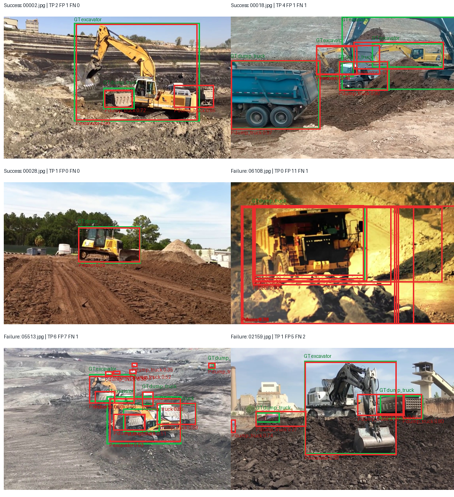

| Type | Image | TP | FP | FN |
|---|---|---:|---:|---:|
| Success | 00002.jpg | 2 | 1 | 0 |
| Success | 00018.jpg | 4 | 1 | 1 |
| Success | 00028.jpg | 1 | 0 | 0 |
| Failure | 06108.jpg | 0 | 11 | 1 |
| Failure | 05513.jpg | 6 | 7 | 1 |
| Failure | 02159.jpg | 1 | 5 | 2 |

**Observed in the displayed validation examples:** RetinaNet detects the isolated dozer in 00028.jpg, but the crowded scenes 07480.jpg and 08970.jpg contain several false boxes and missed objects. RT-DETR produces no correct match for the dump truck in 06108.jpg (11 false positives and one missed object); the crowded scenes 05513.jpg and 02159.jpg also show overlapping extra boxes and missed instances. Faster R-CNN observations will be added with its validation board.

**Possible explanations to investigate:** small objects at 640-pixel input resolution may be harder to localize; CNN anchor sizes may not fit the observed box shapes; the class distribution is imbalanced; and overlap or NMS may contribute to duplicate or suppressed detections. These are hypotheses, not causes established by this experiment.

## 8. Comparison and Deployment Discussion

The fastest measured model was RetinaNet at 16.8 FPS. The highest mAP@0.5:0.95 was from RT-DETR-L at 0.750. These results make the fastest model a candidate for real-time monitoring and the most accurate model a candidate for offline review, subject to the class-wise results and failure examples.

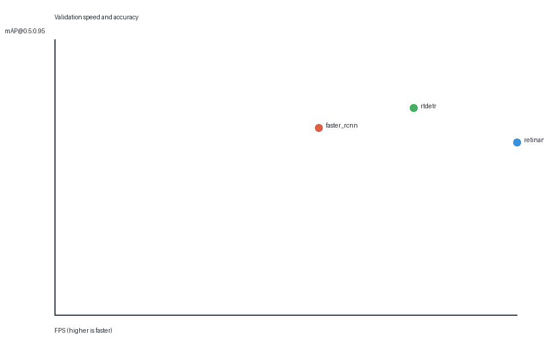

## 9. Limitations

The experiment uses one random image split and a short training budget. The split is not grouped by scene, so visually similar images may occur in different subsets. The detector families use different training implementations and optimization settings. The reported speed depends on the recorded GPU and inference code. Validation results do not replace evaluation on the held-out test split.

## 10. Conclusion

On this validation split, RT-DETR-L had the highest mAP@0.5:0.95 (0.750) and RetinaNet had the highest speed (16.8 FPS). The choice between them depends on whether accuracy or throughput is the main requirement. The class-wise scores and example failures should be considered before deployment.

## Required outputs still to add

The saved metrics are available, but the submission bundle is not complete until these artifacts are added:

- Faster R-CNN qualitative_selection.json

## 11. References

1. Ren et al., 'Faster R-CNN: Towards Real-Time Object Detection with Region Proposal Networks,' NeurIPS, 2015. https://papers.nips.cc/paper_files/paper/2015/hash/14bfa6bb14875e45bba028a21ed38046-Abstract.html
2. Lin et al., 'Focal Loss for Dense Object Detection,' ICCV, 2017. https://openaccess.thecvf.com/content_ICCV_2017/papers/Lin_Focal_Loss_for_Dense_Object_Detection_ICCV_2017_paper.pdf
3. Zhao et al., 'DETRs Beat YOLOs on Real-time Object Detection,' CVPR, 2024. https://openaccess.thecvf.com/content/CVPR2024/html/Zhao_DETRs_Beat_YOLOs_on_Real-time_Object_Detection_CVPR_2024_paper.html
4. ACID dataset, link provided in the assignment brief: https://drive.google.com/uc?id=1Qg_X5FygUMBRTcVFPb0s1fQP-20f8n8O
5. Ultralytics RT-DETR documentation: https://docs.ultralytics.com/models/rtdetr
